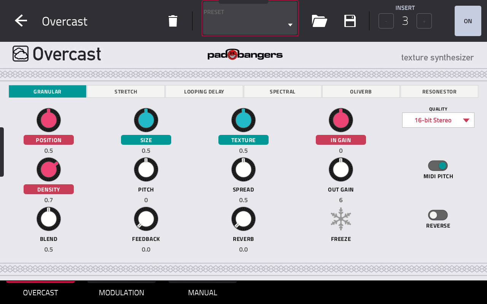
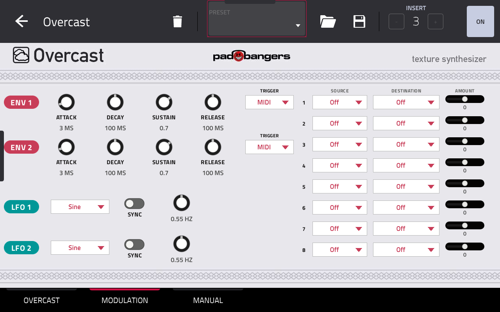
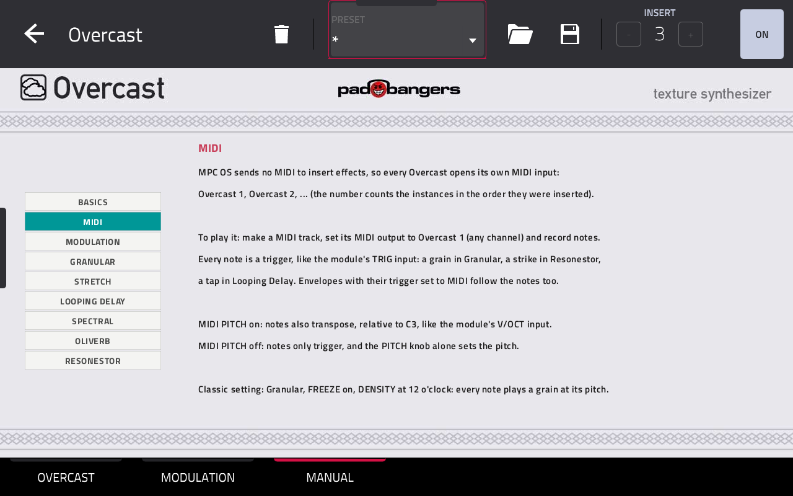

# Overcast

**Overcast** by Padbangers is a texture synthesizer for Akai MPC standalone devices: Mutable Instruments Clouds with
Matthias Puech's Parasites firmware, as a native MPC OS insert effect, with a modulation page on top.

- Six modes: **Granular, Stretch, Looping Delay, Spectral, Oliverb, Resonestor** — the knob names follow the mode.
- **Modulation:** two ADSR envelopes, two LFOs (seven shapes, free or synced to the MPC tempo) and an 8-slot matrix
  onto the module's CV inputs: Position, Size, Pitch, Density, Texture, Blend, Spread, Feedback, Reverb, Freeze and
  Trigger.
- **Play it melodically** like the module's V/OCT and TRIG inputs, from a MIDI track.
- In/Out Gain with an output limiter, Q-Link support on every page.
- A built-in manual on its own tab: basics, MIDI, modulation and every mode.





## Requirements

- A first-generation MPC OS standalone device with a 32-bit ARM CPU: **MPC Live / Live II, One, X, Key 61, Force**.
  Developed and tested on an MPC X.
- **Root SSH access** to the device. Stock MPC OS doesn't offer this; you need a modded unit.
- Installing plugins this way is unofficial. Back up your projects and use it at your own risk.

## Install

1. Download `Overcast-<version>-mpc-armv7.zip` from the [Releases](../../releases) page and check its SHA-256
   against the release notes (`shasum -a 256 <zip>` on macOS/Linux, `certutil -hashfile <zip> SHA256` on Windows).
2. Unzip it and copy the folder to the device:
   ```sh
   unzip Overcast-1.0.0-mpc-armv7.zip
   scp -r Overcast-1.0.0 root@<device-ip>:/tmp/
   ```
3. **Save your project**, then run the installer. It stops MPC, copies the plugin, backs up `MPC.settings`, adds
   Overcast to the plugin list and starts MPC again:
   ```sh
   ssh root@<device-ip> sh /tmp/Overcast-1.0.0/install.sh
   ```
4. Insert **Overcast** as an insert effect on any track (*Insert effects*, manufacturer Padbangers).

**Update:** run the new version's `install.sh` the same way. **Remove:** `sh /tmp/Overcast-<version>/uninstall.sh`.

## Using it

**OVERCAST tab:** pick the mode at the top. Q-Links:

| | | | |
|---|---|---|---|
| Position | Size | Texture | In Gain |
| Density | Pitch | Spread | Out Gain |
| Blend | Feedback | Reverb | Freeze |
| Mode | Quality | MIDI Pitch | Reverse |

Tips: in Granular, Density at 12 o'clock means no grains (counter-clockwise: steady rate, clockwise: random). Freeze stops
recording into the buffer — with Blend below 100 % you still hear the dry input next to the frozen cloud.

**MANUAL tab:** a short manual on the device: basics, MIDI, modulation and each mode.

**MODULATION tab:** envelopes and LFOs on the left, the matrix on the right (source → destination → amount,
−100…+100 %). With SYNC on, an LFO's rate knob picks the note value (4 bars … 1/32) and shows it under the knob. Freeze and Trigger destinations are gates: on above 50 %. An LFO square wave on Trigger clocks grains
(or strikes the Resonestor) in time with the MPC.

**MIDI (melodic playing):** MPC OS sends no MIDI to insert effects, so every Overcast instance opens its own MIDI
input, **Overcast 1**, **Overcast 2**, … Make a MIDI track, set its output to *Overcast 1*, and play: each note is a
trigger, and with MIDI Pitch on it transposes relative to C3 (like V/OCT). Classic setting: Freeze on, Density at
12 o'clock — every note plays a grain at its pitch. In Resonestor, notes play the resonator and switch its two voices.
Envelopes set to *MIDI* follow these notes too.

The Q-Link display shows `<program name> (<parameter>)`: rename the track's program to "Overcast" to read
"Overcast (Position)". After replacing the plugin file by hand, restart the MPC app — re-inserting the plugin doesn't
always load the new file.

Differences from the module: it runs at the MPC's 44.1 kHz instead of 32 kHz (pitch is right; the buffer is about a
quarter shorter and time constants are a little faster).

## Build from source

Needs Docker (with QEMU for 32-bit ARM containers), Python 3 and bash ≥ 4. The plugin framework is a submodule:

```sh
git clone --recursive https://github.com/FullPace/overcast
cd overcast
./build.sh            # -> build/overcast.so + skin
./deploy.sh <host>    # copy to a device over ssh (--yes also registers it; restarts MPC)
```

The skin is generated: `python3 skin/gen_layout.py` (layout), `python3 skin/gen_params.py` (modulation params).
Developer notes, device findings and design decisions: [`CLAUDE.md`](CLAUDE.md).

## Credits and licenses

- Overcast: MIT, see [`LICENSE`](LICENSE).
- Clouds DSP by Emilie Gillet, Parasites firmware by Matthias Puech — MIT, vendored in `third_party/parasites/`.
- Plugin framework: [sd88me/mpc-vst-plugins](https://github.com/sd88me/mpc-vst-plugins) (submodule; build-time only).
- Not affiliated with Mutable Instruments or Akai Professional.
